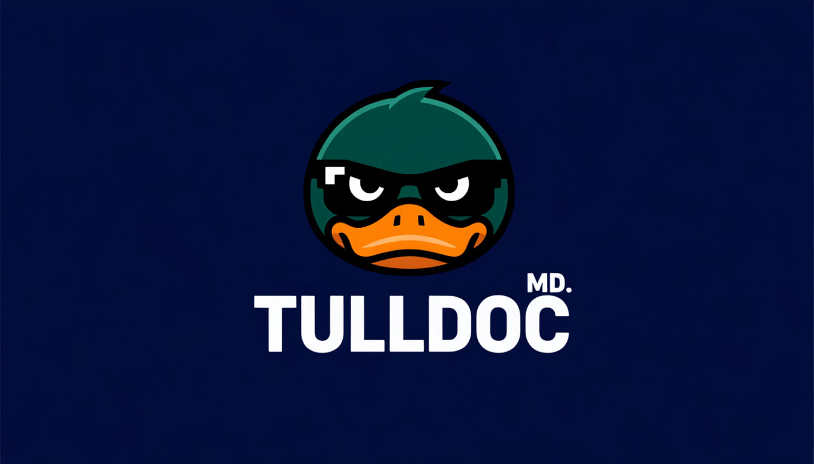

<div align="center">



# Tulldoc

**Documentation sites for component libraries — built straight from your source code.**

[](#status)
[](https://nextjs.org)
[](https://react.dev)

[**📖 Documentation**](https://tulldoc.tulls.ru/) · [Getting started](#getting-started) · [Addon](#addon-tulls-mdtulldoc-code)

</div>

> [!WARNING]
> **Status:** Tulldoc is under active development and is **not yet ready** for publishing or production use. APIs may change without notice.

---

`@tulls-md/tulldoc` is a library for quickly building documentation sites for component libraries, powered by Next.js.

Docs and examples are generated **directly from your component source**: props tables are extracted from TypeScript types, and variant examples are produced automatically from union types — so the documentation never drifts out of sync with the code.

## Why Tulldoc

- 📁 **File-system routing** — every `.mdx` file in your `contentDir` automatically becomes a page.
- 🧭 **Generated sidebar** — built from your folder structure, with ordering controlled via `meta.json`.
- 🧱 **Batteries-included UI** — ready-made blocks like `CodeBlock`, `Preview`, `DocTabs`, `DocNotice`, and more.
- 🎨 **First-class syntax highlighting** — powered by [Shiki](https://shiki.style), with GFM and frontmatter support.
- 🔌 **Source-driven docs (opt-in)** — props tables from TypeScript types and auto-generated variant examples via the [`@tulls-md/tulldoc-code`](#addon-tulls-mdtulldoc-code) addon.

The core ships only what an MDX documentation site needs. Code-analysis dependencies (`@babel/parser`, the `typescript` compiler) live in a separate addon — if you only need MDX docs, you never pull them in.

## Requirements

| Dependency | Version    |
|------------|------------|
| `next`     | `>= 16`    |
| `react`    | `>= 19`    |
| `react-dom`| `>= 19`    |

These are **peer dependencies** — Tulldoc relies on the versions installed in your project.

## Getting started

### 1. Wrap your Next.js config

```ts
// next.config.ts
import { withTulldoc } from "@tulls-md/tulldoc/config";

export default withTulldoc();
```

### 2. Create a documentation source

```ts
// src/docs.ts
import { join } from "path";
import { createDocSource } from "@tulls-md/tulldoc/server";

export const docs = createDocSource({
  contentDir: join(process.cwd(), "src/content"),
  importContent: (path) => import(`./content/${path}.mdx`),
  lang: "en",
});
```

### 3. Wire up the App Router

```tsx
// src/app/layout.tsx
import { docs } from "@/docs";

export default docs.Layout;
```

```tsx
// src/app/[...slug]/page.tsx
import { docs } from "@/docs";

export const dynamicParams = false;
export const generateStaticParams = docs.generateStaticParams;
export const generateMetadata = docs.generateMetadata;

export default docs.Page;
```

That's it — drop `.mdx` files into `src/content` and they become pages. See the [**Getting Started**](https://tulldoc.tulls.ru/) section of the docs for the full walkthrough.

## Package entry points

The core package, `@tulls-md/tulldoc`, exposes three entry points:

| Entry point                | Purpose                                                  |
|----------------------------|----------------------------------------------------------|
| `@tulls-md/tulldoc`        | UI blocks and MDX utilities (client + server)            |
| `@tulls-md/tulldoc/server` | Server helpers: `createDocSource`, `getNavItems`         |
| `@tulls-md/tulldoc/config` | `withTulldoc` — the wrapper for `next.config.ts`         |

## Addon: `@tulls-md/tulldoc-code`

Documenting React components from their source code is handled by a **separate** package, installed on demand:

```bash
pnpm add @tulls-md/tulldoc-code
```

| Entry point                     | Purpose                                                                  |
|---------------------------------|--------------------------------------------------------------------------|
| `@tulls-md/tulldoc-code`        | UI blocks: `PropsTable`, `ComponentPreview`, `ExampleVariants`, `Anatomy`|
| `@tulls-md/tulldoc-code/server` | `componentDocs` plugin, `createComponentPreview` / `Examples` / `Props`  |

Hook it into `createDocSource` as a plugin:

```ts
// src/docs.ts
import { createDocSource } from "@tulls-md/tulldoc/server";
import { componentDocs } from "@tulls-md/tulldoc-code/server";

export const docs = createDocSource({
  contentDir: join(process.cwd(), "src/content"),
  importContent: (path) => import(`./content/${path}.mdx`),
  plugins: [
    componentDocs({
      importDoc: (path) => import(`./content/${path}.doc.tsx`),
      componentsDir: join(process.cwd(), "../ui/src/components"),
      examplesDir: join(process.cwd(), "src/examples"),
    }),
  ],
  lang: "en",
});
```

Without the addon, `.doc.tsx` documents are unavailable and `createDocSource` processes only `.mdx` files.

## Repository structure

Tulldoc is a pnpm monorepo:

| Package          | Description                                                   |
|------------------|---------------------------------------------------------------|
| `lib/`           | Core `@tulls-md/tulldoc` (the MDX site)                       |
| `lib-code/`      | Addon `@tulls-md/tulldoc-code` (component documentation)      |
| `documentation/` | The tulldoc documentation site (built with tulldoc itself)   |
| `example/`       | An example documentation project                             |

## Development

**Requirements:** Node.js `>= 24`, pnpm `>= 10`.

```bash
pnpm install

# run the documentation site (dev mode)
pnpm tulldoc:docs

# run the example site (dev mode)
pnpm tulldoc:examle

# formatting
pnpm format
pnpm format:check
```

## Status

Tulldoc is **work in progress**. The current goal is a first publish to npm; expect breaking changes until then.
